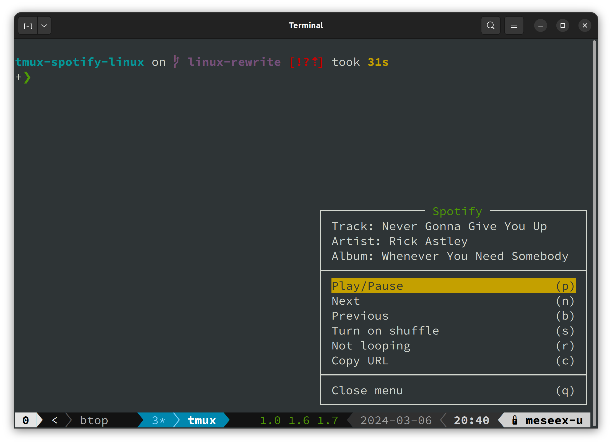
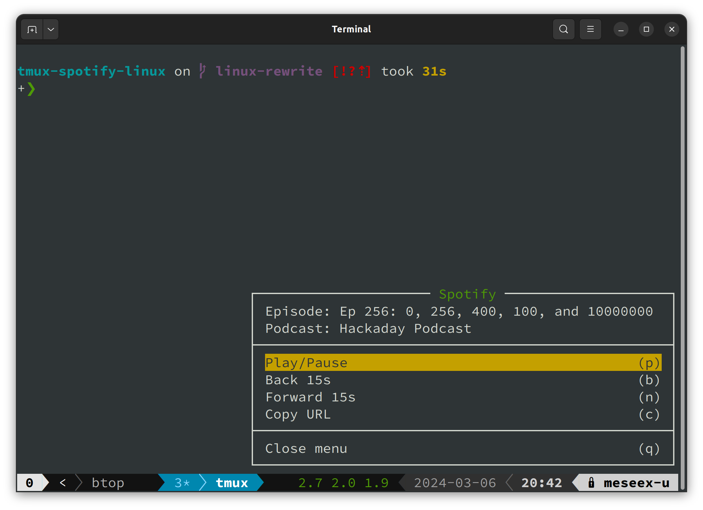
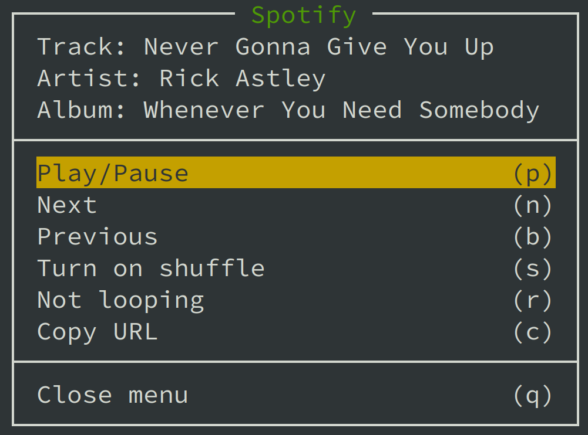
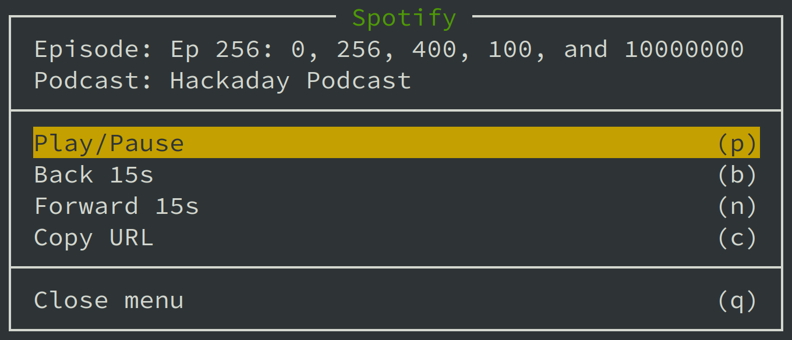

# Spotify plugin for tmux on Linux

[](https://conventionalcommits.org) [](http://commitizen.github.io/cz-cli/) [](https://opensource.org/licenses/MIT)

Show a nice menu to control Spotify application.




## Installation

### Requirements

* Linux
* tmux >= 3.0
* Spotify application (if you use cotained installs like Snap or Flatpak, make sure Spotify can communicate with DBus)

### With [Tmux Plugin Manager](https://github.com/tmux-plugins/tpm)

Add the plugin in `.tmux.conf`:

```conf
set -g @plugin 'malanius/tmux-spotify-linux'
```

Press `prefix + I` to fetch the plugin and source it. Done.

### Manual

Clone the repo somewhere. Add `run-shell` in the end of `.tmux.conf`:

```conf
run-shell PATH_TO_REPO/tmux-spotify.tmux
```

NOTE: this line should be placed after `set-option -g status-right ...`.

Press `prefix + :` and type `source-file ~/.tmux.conf`. Done.

## Usage

**Spotify must be running** to use the plugin, the menu will tell you if not. (for some reason, `xdg-open` doesn't work well with Spotify, i.e. if you have Spotify running and playing on other device, `xdg-open` will open a new instance of Spotify and breaks the playback everywhere and got mine mobile app completely stuck reliably) - thoughts or PRs welcome!

Press tmux `prefix + S` (for example, `C-a S`) and you will see a nice menu.

### Music control



```text
* Play/Pause      (p) - toggle play/pause
* Next            (n) - play the next track
* Previous        (b) - play the current track from the beggining or play the previous track
* Turn on shuffle (s) - switch on/off current playlist's shuffling
* Copy URL        (c) - copy Spotify URL of the current track to the clipboard
* Toggle repeat   (r) - switcher repet mode between none, playlist and track
* Close menu      (q) - close menu
```

### Podcast control



```text
* Play/Pause      (p) - toggle play/pause
* Back 15s        (b) - seek back 15 seconds
* Forward 15s     (f) - seek forward 15 seconds
* Copy URL        (c) - copy Spotify URL of the current podcast to the clipboard
```

## Why this plugin?

This is a Linux rewrite of [tmux-spotify](https://github.com/xamut/tmux-spotify) levaraging `dbus` to control Spotify. The original plugin uses AppleScript to control Spotify on macOS.

There is [another Linux version](https://github.com/pwittchen/tmux-plugin-spotify) of the plugin, but that depends on Python-based [spotify-cli-linux](https://github.com/pwittchen/spotify-cli-linux), so another dependency and it doesn't do all the things I've wanted (seek, copy URL and others).

But since almost every media player on Linux supports [MPRIS](https://specifications.freedesktop.org/mpris-spec/latest/), Spotify included (after some [peer pressure](https://community.spotify.com/t5/forums/searchpage/tab/message?q=mpris) from the community it mostly works), I've decided to write a plugin that uses MPRIS to control Spotify.

## Acknowledgements

* [xamut](https://github.com/xamut) for the original plugin that inspired this
* [pwittchen](https://github.com/pwittchen/) for the Python cli app that showed me that using MPRIS is possible
* creators of [D-Spy](https://apps.gnome.org/en-GB/Dspy/) which has been invaluable in figuring out how to control Spotify via MPRIS and DBus

## License

`tmux-spotify-linux` plugin is released under the [MIT License](https://opensource.org/licenses/MIT).
